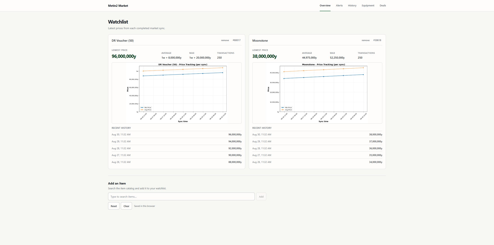
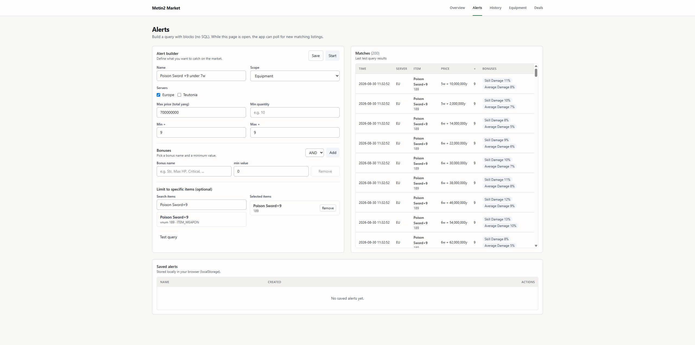
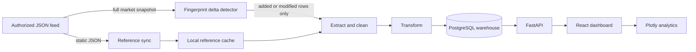
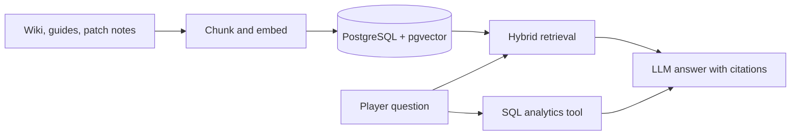

<p align="center">
  
</p>

<h1 align="center">Metin2 Market Warehouse</h1>

<p align="center">
  A full-stack market intelligence platform that turns live Metin2 listings into searchable price history, equipment analysis, alerts, and deal signals.
</p>

<p align="center">
  
  
  
  
  
  
</p>

---

## What it does

- Tracks selected items and their latest, average, and maximum prices.
- Explores historical prices with server, category, and enchantment filters.
- Estimates equipment value and measures the price impact of individual bonuses.
- Searches current listings and surfaces potentially undervalued deals.
- Imports English item metadata and listings from a configurable, authorized JSON feed.
- Loads a PostgreSQL fact-constellation warehouse through an automated ETL pipeline.
- Exposes the warehouse through a documented FastAPI API and a focused light React dashboard.

## Interface

### Market dashboard



### Alert builder and matching listings



## Tech stack

| Layer | Technology | Role |
|---|---|---|
| Frontend | React 19, Vite 7, React Router | Dashboard shell, navigation, and client state. |
| UI | Tailwind CSS, custom CSS | Desktop product layout and light visual system. |
| Charts | Plotly.js basic bundle | Interactive price-history and bonus-impact charts. |
| API | Python 3.10+, FastAPI, Uvicorn | HTTP API, validation, health checks, and sync lifecycle. |
| Data processing | Pandas, NumPy | Cleaning, normalization, and market analytics. |
| ETL | PyGramETL, SQLAlchemy, psycopg2 | Dimensional loading and PostgreSQL access. |
| Warehouse | PostgreSQL 16 | Constellation schema with shared item/time dimensions. |
| Infrastructure | Docker Compose | Reproducible local database initialization. |
| Testing | Pytest, HTTPX, ESLint | API smoke tests and frontend quality checks. |

## Architecture



The warehouse uses shared `dim_item` and `dim_time` dimensions across transaction, price-history, attribute, undervaluation, weapon, armor, and pet fact tables. See the complete [constellation schema](sql/constellation_schema.sql).

## Quick start

### Prerequisites

- Python 3.10+
- Node.js 20+
- Docker Desktop, or an existing PostgreSQL server

### 1. Configure the project

```powershell
Copy-Item .env.example .env
```

The example configuration matches the included Docker database. If port `5432` is already occupied, either stop the existing PostgreSQL service or change both the Compose port mapping and `DB_PORT`.

### 2. Start PostgreSQL

```powershell
docker compose up -d database
docker compose ps
```

On its first start, PostgreSQL automatically applies `sql/constellation_schema.sql`.

Already have PostgreSQL? Create a database named `metin2_warehouse`, apply the schema manually, and update the five `DB_*` values in `.env`.

### 3. Start the API

```powershell
python -m venv .venv
.\.venv\Scripts\Activate.ps1
python -m pip install --upgrade pip
pip install -r requirements.txt
python -m uvicorn api.main:app --reload
```

The API is now available at:

- API: <http://localhost:8000>
- Interactive docs: <http://localhost:8000/docs>
- Liveness check: <http://localhost:8000/health>
- Database readiness: <http://localhost:8000/ready>

External synchronization is disabled by default. The API starts without making network requests. To use ingestion, configure an authorized URL in `EXTERNAL_MARKET_URL_TEMPLATE`, then set `EXTERNAL_SYNC_ENABLED=true`.

The repository already contains an English static-reference snapshot. Static refresh is controlled separately through `EXTERNAL_STATIC_SYNC_ENABLED` and requires an authorized `EXTERNAL_STATIC_BASE_URL`.

### 4. Start the dashboard

Open another terminal:

```powershell
Set-Location web
npm ci
npm run dev
```

Visit <http://localhost:5173>. Vite proxies `/api`, `/docs`, `/openapi.json`, and `/health` to FastAPI on port `8000`.

<details>
<summary>macOS / Linux activation command</summary>

```bash
source .venv/bin/activate
```

</details>

## Dashboard areas

| Area | Purpose |
|---|---|
| Home | Keep a browser-persisted watchlist and inspect recent price cards. |
| Alerts | Query listings with item, server, category, price, and bonus conditions. |
| Price history | Compare minimum and average prices over configurable periods. |
| Equipment | Estimate an item and visualize how bonuses affect market value. |
| Deals | Review listings identified as unusually cheap. |

## Configuration

Start with [.env.example](.env.example). These are the settings most commonly changed:

| Variable | Default | Meaning |
|---|---:|---|
| `DB_HOST` / `DB_PORT` | `localhost` / `5432` | PostgreSQL address. |
| `DB_NAME` | `metin2_warehouse` | Warehouse database. |
| `DB_USER` / `DB_PASSWORD` | `postgres` / `postgres` | Local development credentials. |
| `EXTERNAL_SYNC_ENABLED` | `false` | Enables the in-process background sync worker. |
| `EXTERNAL_MARKET_URL_TEMPLATE` | empty | Authorized JSON URL containing `{server_id}`. Required when sync is enabled. |
| `EXTERNAL_SYNC_LOAD_MODE` | `delta` | `delta` loads additions/modifications; `snapshot` loads every row. |
| `EXTERNAL_STATIC_SYNC_ENABLED` | `false` | Enables refreshing bundled item/stat reference files. |
| `EXTERNAL_STATIC_BASE_URL` | empty | Authorized origin for the expected `/m2_data/...` paths. |
| `EXTERNAL_SERVER_IDS` | `502,71` | Comma-separated server IDs; defaults to Europe and Teutonia. |
| `EXTERNAL_SYNC_MIN_MINUTES` | `10` | Minimum delay between sync cycles. |
| `EXTERNAL_SYNC_MAX_MINUTES` | `15` | Maximum delay between sync cycles. |
| `WON_TO_YANG` | `100000000` | Conversion used during price normalization. |
| `CORS_ORIGINS` | local Vite origins | Comma-separated browser origins allowed to call the API. |

## API map

| Prefix | Responsibility |
|---|---|
| `/api/dashboard` | Dashboard searches, listing queries, KPIs, estimates, and charts. |
| `/api/items` | Item search, details, comparisons, and item-type queries. |
| `/api/analytics` | Trends, volatility, market snapshots, deals, and predictions. |
| `/api/reference` | Category and enchantment labels from the local static cache. |
| `/api/etl` | Manual ingestion and ETL job operations. |
| `/api/admin` | Database and operational maintenance endpoints. |

FastAPI’s `/docs` page is the authoritative, executable endpoint reference.

`/health` confirms that the API process is alive. `/ready` additionally runs a small PostgreSQL query and returns HTTP `503` until the warehouse credentials and schema are usable.

## Incremental JSON loading

The source is treated as a market snapshot, but the ETL no longer reloads every row on every change:

1. The client sends `If-None-Match` / `If-Modified-Since` and skips the body when the provider supports HTTP `304` responses.
2. Otherwise, the feed is downloaded and exact duplicates are removed.
3. Each normalized listing receives a stable SHA-256 fingerprint.
4. Those fingerprints are compared with the last successfully loaded snapshot.
5. Only added or modified listings enter Pandas and the ETL pipeline.
6. The sync state records added, removed, and unchanged counts.
7. The fingerprint snapshot advances only after ETL succeeds, so failed rows are retried.

The first run necessarily loads the full snapshot. A modified listing appears as one removal plus one addition because the legacy payload has no documented stable listing ID. Removed rows are counted but historical warehouse facts are retained intentionally.

This saves database work and ETL time. It cannot save download bandwidth when a provider only exposes a full JSON file; that requires provider support for conditional requests, a delta API, or a change stream.

Set `EXTERNAL_SYNC_LOAD_MODE=snapshot` if you need the previous full-snapshot behavior. Runtime state and fingerprint files match `sync_state*.json` and are excluded from Git.

## RAG and vector database decision

RAG is not part of the core market pipeline—and that is intentional. Prices, quantities, bonuses, servers, and timestamps are structured facts. SQL filters and aggregations are more accurate, cheaper, and easier to verify than semantic vector search for this data.

RAG becomes worthwhile if the product adds an assistant that answers questions from unstructured material such as wiki pages, item descriptions, patch notes, or player guides. The sensible design would be:



If that feature is added, use `pgvector` inside the existing PostgreSQL deployment instead of operating a separate vector database. Keep live price calculations in SQL and use RAG only for explanatory text. Until an actual document corpus and assistant UI exist, adding embeddings would increase cost and maintenance without improving the current dashboard.

## Development checks

Backend tests do not require PostgreSQL or external internet access:

```powershell
pip install -r requirements-dev.txt
python -m pytest
```

The suite covers API liveness/readiness, bundled reference data, snapshot deltas,
sparse feed rows, and a real HTTP fetch against an ephemeral loopback JSON server.
The network test verifies JSON parsing, ETL handoff, persisted sync state, ETag
reuse, and the provider-style `304 Not Modified` path without using mocks for the
HTTP request itself.

Frontend quality checks:

```powershell
Set-Location web
npm run check
npm audit --omit=dev
```

## Project layout

```text
api/          FastAPI application and route groups
config/       Environment and server configuration
data/         Bundled/synchronized Metin2 reference data
etl/          Extraction, cleaning, transformation, and loading
models/       Market domain models
report/       LaTeX project report and diagrams
scripts/      One-off price migration utilities
sql/          PostgreSQL constellation schema
sync/         Static-data and periodic market synchronization
tests/        Database-free API smoke tests
web/          React/Vite dashboard
```

## Troubleshooting

**`password authentication failed for user "postgres"`**

PostgreSQL is reachable, but `.env` does not match that server. Update `DB_USER` and `DB_PASSWORD`, or use the included Compose database. Remember that an existing Docker volume keeps the password from its first initialization.

**The dashboard opens but shows request errors**

Confirm <http://localhost:8000/health> responds, then check the API terminal. Most analytics endpoints require a reachable, initialized PostgreSQL database.

**Reference endpoints return `503`**

Make sure `data/external/m2_data/en` exists or enable synchronization. The repository includes an initial English reference snapshot, so this should work before the first sync.

**No listings appear immediately**

Synchronization is off by default. Configure an authorized `EXTERNAL_MARKET_URL_TEMPLATE`, enable sync, then inspect `sync_state_<server-id>.json` and the API logs for fetch or database errors.

## Safety and scope

The `/api/admin` routes include destructive maintenance operations. They require explicit confirmation where applicable, but they are not authenticated. Treat this as a trusted local-development application and do not expose it directly to the public internet without adding authentication, authorization, rate limiting, and production CORS settings.

The former hard-coded Metin2Alerts market URL now returns `404`, and its current [Terms of Service](https://metin2alerts.com/store/en/terms) prohibit scraping or automated access. For that reason, automatic sync is disabled and no provider URL is configured by default. Use only a feed you own or have permission to access.

Market data belongs to its respective providers and game assets belong to their respective owners. This project is an independent analytics/educational project and is not affiliated with Gameforge or Webzen.

## License

No license file is currently included. Unless the repository owner adds one, the source is not implicitly licensed for redistribution.
